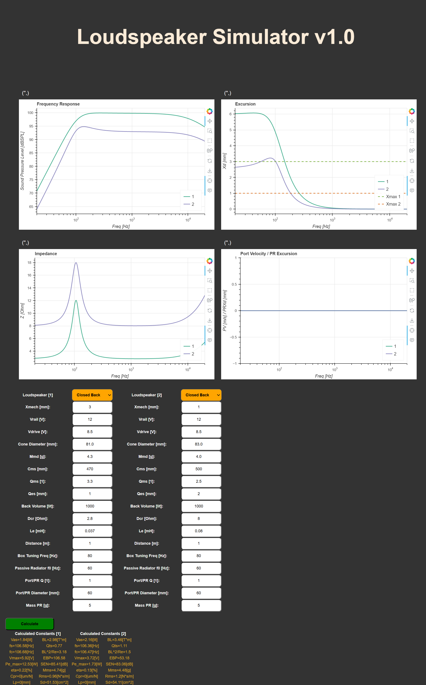
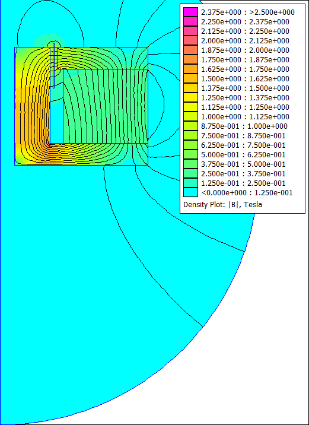
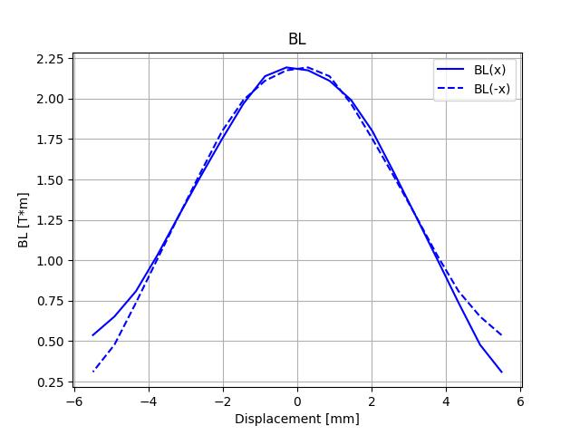
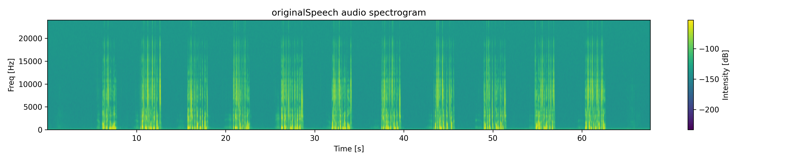
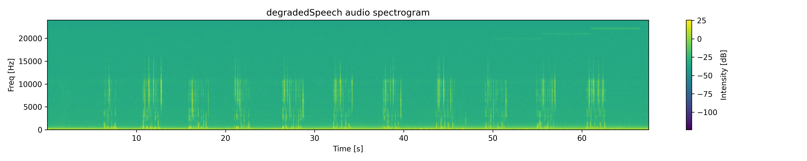
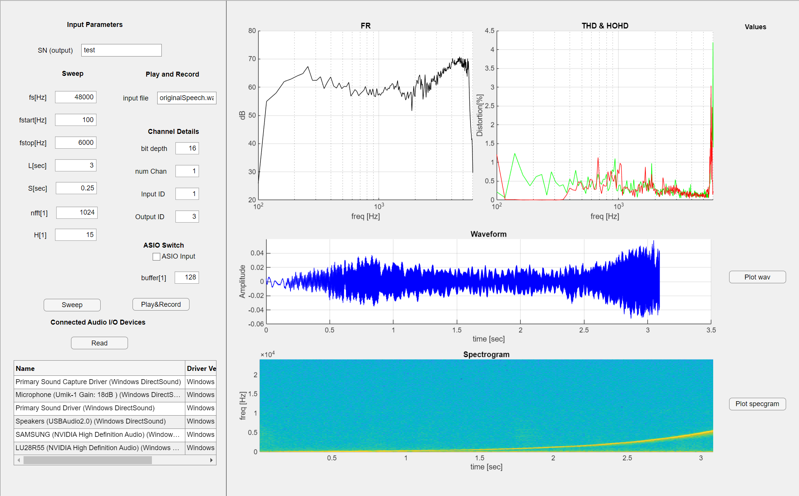
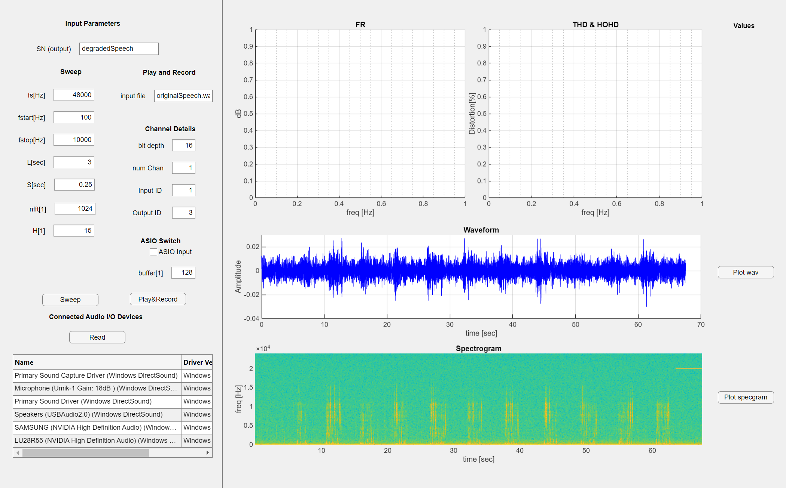

# General Information

This repository houses highlights from the acoustic engineering tools
present within this personal github account. Highlights from other 
repository heads are not displayed here.

### Author

Author: [Michael Asfaw](https://www.linkedin.com/in/michael-asfaw-72723a2b/)\
Created: Feb 18, 2025\
Updated: Jul 9, 2025

### Table of Contents:
- [Loudspeaker LPM Simulation Tool](#item-one)
- [Loudspeaker Magnetics Simulation Tool](#item-two)
- [Speech Mean Opinion Score Using PESQ MOS](#item-three)
- [Memory Manipulation on MSP423 ARM CORTEX-M4 MCU](#item-four)
- [Speech Transcription and Word Error Rate Calculation](#item-five)
- [MATLAB GUI Application for Testing Microphones and Loudspeakers](#item-six)


<details>
<a id="item-one"></a>
<summary><strong>Loudspeaker LPM Simulation Tool</summary>

<hr>

>[!NOTE]

A browser accessible loudspeaker linear parameter design application. The files 
in this repository are written to specify a loudspeaker from it's linear parameters.

### Requirements

    * Python 3.12.3
    * flask
    * numpy
    * waitress
    * python-dotenv
    * bokeh
    * loudspeaker
    * loudspeakerBokehPlotter

### Installation

To install, run this command in bash

```bash
git clone https://github.com/mikaellum/loudspeaker-app-py.git
```

### Execution

For getting the sever up

```shell
python3 server.py
```

On a browser

[Loudspeaker](http://localhost:8000/)

### Outputs

The output html app looks *similar* to:


</details>

<hr>

<details>
<a id="item-two"></a>
<summary><strong>Loudspeaker Magnetics Simulation Tool</summary>

<hr>

>[!NOTE]

The files in this repository are written to run determine the electromotive
properties of a loudspeaker using FEMM and the mechanical dimensions of the
loudspeaker motor.

### Requirements

    * Python 3.12.2
    * pyfemm
    * numpy
    * math

The files in this repository are written to help design
a loudspeaker motor systems.

### Installation

To install, run this command in bash

```bash
git clone https://github.com/mikaellum/loudspeaker-magnetics-pyFEMM.git
```

### Execution

For getting voice coil properties

```shell
python3 VoiceCoil.py Rdc NumLayers WireDiameter IACS BobbinDiameter SpecGravity insThick
```

Using the output from the voice coil properties, can calculate the motor properties

```shell
python3 Motor.py Ag Ph Pr Pcr Pbh Pbr Wh Vch Vcw Vco Mh Mw Bm Nturns WireGuage SoftSteel Magnet R M_domain M_motor M_vc times_x times_y Xmax N
```

### Outputs

output for voice coil *similar* to:

```
Design Width: 0.22[mm]
Design Height: 6.02[mm]
Number of Turns of the Voice Coil: 83
Mass of the Voice Coil: 0.41[g]
```

output for the motor *similar* to:

```
Rdc of the voice coil is: 5.14[Ohm]
BL of the motor is: 2.18[T*m]
Mass of the Motor is: 112.61[g]
Total Volume of the Motor is: 16.29[cc]
```

the output plots flux density heat-map are *similar* to:



the output plots for the non-linear BL are *similar* to:



</details>

<hr>

<details>
<a id="item-three"></a>
<summary><strong>Speech Mean Opinion Score Using PESQ MOS</summary>

<hr>

>[!NOTE]

Python code to determine PESQ-MOS of a degraded audio file to an original
for both wideband and narrowband applications

### Requirements

    * Python 3.12.2
    * pesq
    * scipy
    * matplotlib

The files in this repository are written to help get the
PESQ MOS scores for speech (telephony standard).

### Installation

To install, run this command in bash

```
git clone https://github.com/mikaellum/PESQ-MOS-py.git
```

### Execution

For getting the MOS score values

```shell
python3 mosScore.py original degraded
```

To visualize the spectrogram of the *.wav* files

```shell
python3 plotSpecgram.py file nfft noverlap cmap figWidth figHeight
```

### Outputs

output for the MOS scores is *similar* to:

```
The narrow band MOS is:  4.38
The wide band MOS is:  4.33
```

the output specgram for the orignal speech file is *similar* to:



the output specgram for the degraded speech file is *similar* to:




</details>

<hr>

<details>
<a id="item-four"></a>
<summary><strong>Memory Manipulation on MSP423 ARM CORTEX-M4 MCU</summary>

<hr>

>[!NOTE]

Assignment packages and solutions for [Embedded Systems](https://www.coursera.org/learn/introduction-embedded-systems) class on Coursera.
The folders are the assignments, to compile the code use standard make command.
The output and object files are not included in the repository (.gitignore)

The code is intended to manipulate registers and memory addresses on a TI MSP423 ARM CORTEX-M4
Evaluation Kit.

### Requirements

	* gcc 11.4.0
	* gcc-arm-none-eabi
	* make

### Installation

To install, run this command in bash

```bash
git clone https://github.com/mikaellum/Embedded-Systems-Coursera.git
```

### Compilation

```shell
cd course1/
make
```

</details>

<hr>

<details>
<a id="item-five"></a>
<summary><strong>Speech Transcription and Word Error Rate Calculation</summary>

<hr>

>[!NOTE]

The files in this repository are written to help compare speech to text algorithms.

### Requirements

    * Python 3.12.2
    * numpy
    * whisper
    * SpeechRecognition
    * Sphinx


### Installation

To install, run this command in bash

```bash
git clone https://github.com/mikaellum/STT-TTS-WER-py.git
```

### Execution

Example command for using sphinx model

```shell
python3 recognize.py originalSpeech.wav sphinx HL1reference.txt
```

Example command for using whisper model

```shell
python3 recognize.py originalSpeech.wav whisper HL1reference.txt
```

### Outputs

transcription of the reference the *.wav* file is *similar* to:

```
Harvard List Number One. The birch canoe slid on the smooth planks. Glue the sheet to the dark blue background. It's easy to tell the depth of a well.These days a chicken leg is a rare dish. Rice is often served in round bowls. The juice of lemons makes fine punch. The box was thrown beside the parked truck. The hogs were fed chopped corn and garbage. Four hours of steady work faced us. A large size in stockings is hard to sell.
```

sphinx transcription of the *.wav* file is *similar* to:

```
competence number won the bet you they say the list may thanks this she did the dog of the background is she he'd tell the depth of the well of the stays at chicken leg is a bad day she writes is often said to round balls that she said lemons make a fine conch the boxes friend beside the puppets talk the hopeless fed chopped colon and garbage full houses steady well at fakes does not slices stockings is hard to sell
```

```
Word Error Rate of sphinx is: 75.904 [%]
```

whisper transcription of the *.wav* file is *similar* to:

```
Harvard List Number One, the Birch canoes slid on the smooth planks. Do the sheet to the dark blue background. It's easy to tell the depth of a well. These days a chicken leg is a rare dish. Rice is often served in round bowls. The juice of lemons makes fine punch. The box was thrown beside the parked truck. The hoax were fed chopped corn and garbage. Four hours of steady work faced us. Large size and stockings is hard to sell.
```

```
Word Error Rate of whisper is: 0.000 [%]
```

</details>

<hr>

<details>
<a id="item-six"></a>
<summary><strong>MATLAB GUI Application for Testing Microphones and Loudspeakers</summary>

<hr>

>[!IMPORTANT]

    * Requires MATLAB 2024b

The files in this repository are written to in MATLAB to create a GUI Application
for audio testing of Speakers and Microphones

### Outputs

The GUI for sweep tests looks *similar* to:



The GUI for play and record tests looks *similar* to:



<hr>

</details>
