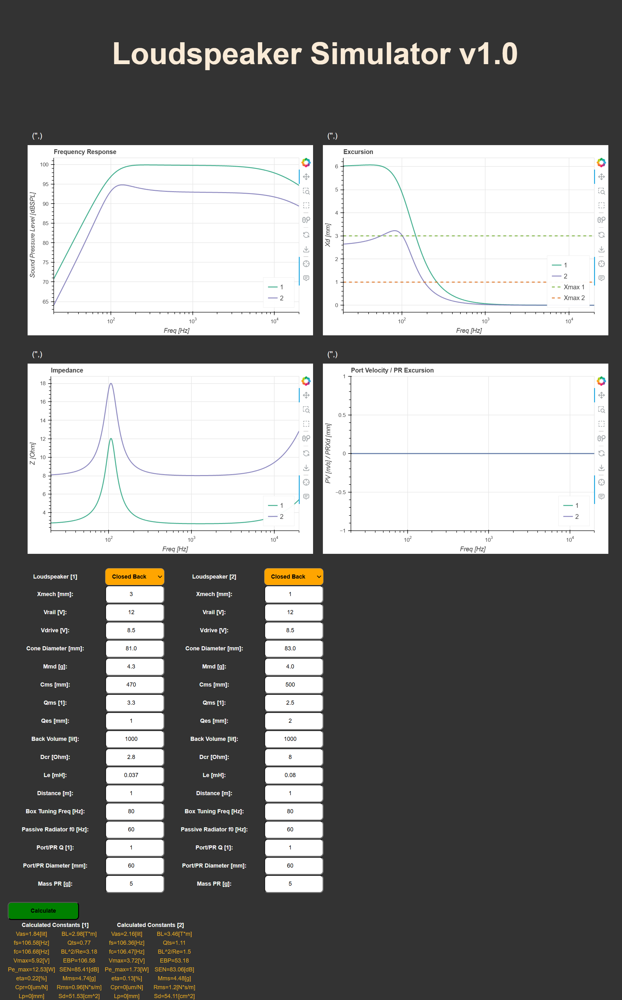
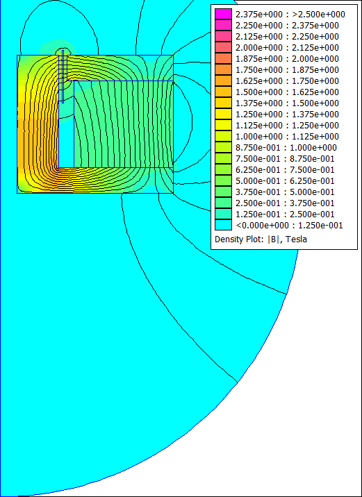
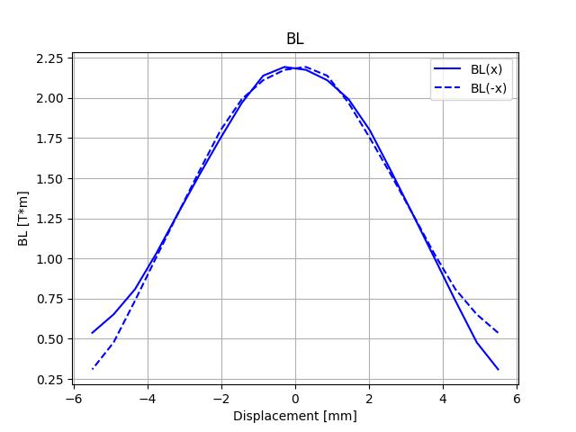
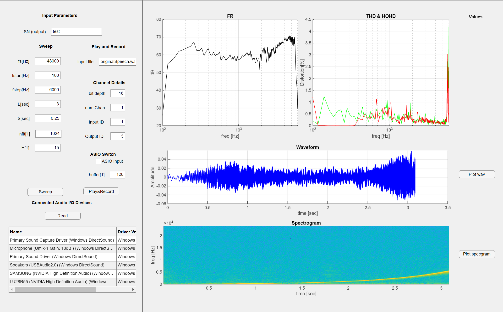
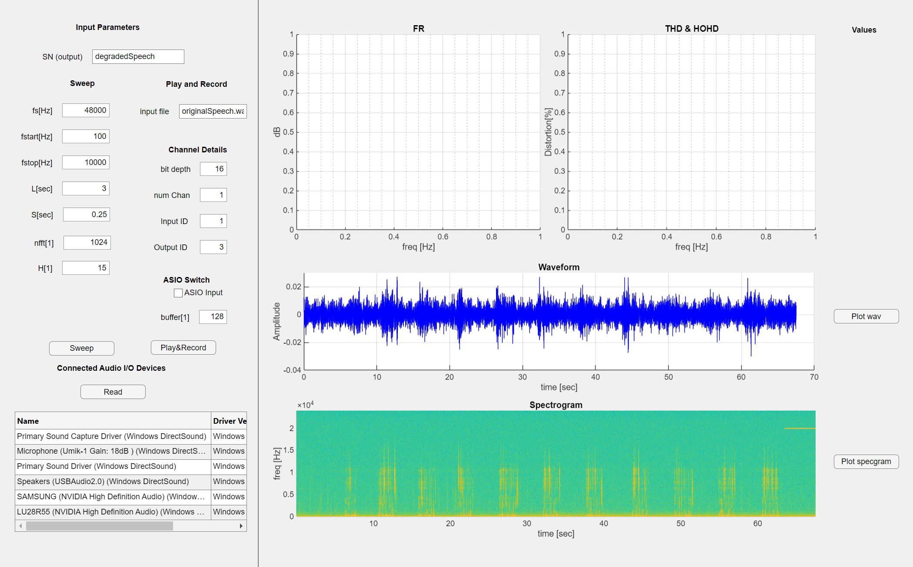
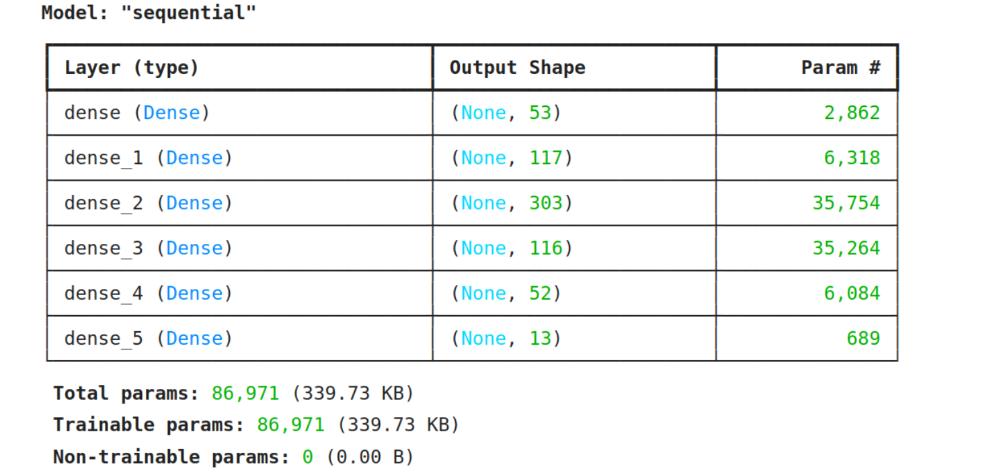
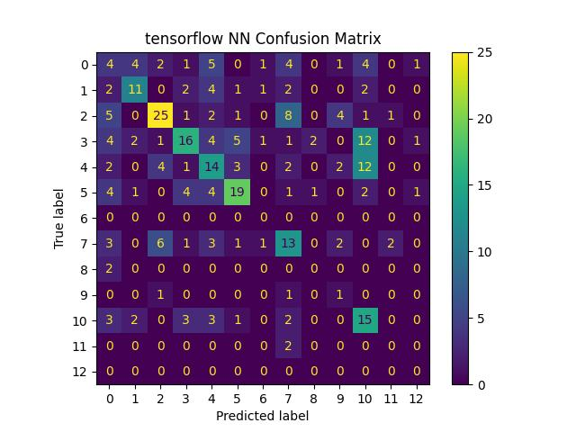
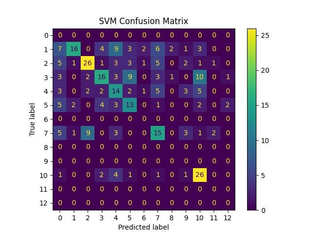

# Mikael Asfaw

**Founder & Chief Engineer | Embedded Audio, Multimodal Sensing & Edge AI | 19+ Patents**

San Carlos, California · [LinkedIn](https://www.linkedin.com/in/mikael-asfaw-72723a2b/) · [GitHub](https://github.com/mikaellum)

---

## Summary

Founder and engineering leader with 10+ years of experience architecting and shipping production-scale audio, acoustic, sensing, and embedded systems across humanoid robotics, autonomous vehicles, automotive, AR/VR, wearables, security devices, and consumer electronics. Inventor on 19+ pending and granted U.S. patents.

**What we’re building now.** Stealth-startup focused on human-centered edge AI—bringing sensing, perception, and intelligent audio together in wearable form factors. Product and system details are private; selected inventions are under pending U.S. patent filings.

**How the technical foundation is expanding.** Part-time graduate work in computer engineering at Dartmouth is deepening the stack beyond classical acoustics into camera and sensor pipelines, FPGA-based vision and audio signal paths, real-time filtering and calibration, and end-to-end edge-AI system architecture. Those capabilities feed the stealth work above—and strengthen every tool in this repository.

This site centers on **R&D tools and projects**: practical methods for prototyping, measuring, and validating audio, sensing, and embedded systems.

---

## Capabilities & Skills

| Domain | Capabilities |
|--------|----------------|
| Audio & Acoustics | Transducer design, microphone arrays, loudspeakers, spatial audio, beamforming, direction of arrival, echo control, acoustic measurement and validation |
| Vision, Sensors & Edge | Camera and imaging pipelines (incl. MIPI CSI-2 class interfaces), FPGA vision paths, classical and learning-based machine vision, IMU / inertial sensing, sensor calibration, multimodal perception |
| Embedded Systems & FPGA DSP | Embedded Linux, real-time signal processing, VHDL, I2S audio datapaths, AXI-Stream style streaming, fixed-point FIR and related DSP, SPI / UART / I2C, ADC, GPIO, BTLE, hardware/software bring-up |
| On-Device Intelligence | Deep learning for perception and classification, compact / small language model concepts at the edge, TensorFlow-class tooling, evaluation under constrained compute and power |
| Programming, ML & Data | Python, C, C++, VHDL, MATLAB, TensorFlow, NumPy, Pandas, SciPy, scikit-learn, librosa, statistical analysis and manufacturing analytics |
| Modeling & Hardware | Git, Xilinx Vitis/Vivado, FPGA platforms, Raspberry Pi, STM32, COMSOL, SPICE, SolidWorks, FEA, oscilloscopes, logic analyzers |

---

## R&D Tools & Projects

### Table of Contents
- [Loudspeaker LPM Simulation Tool](#loudspeaker-lpm-simulation-tool)
- [Loudspeaker Magnetics Simulation Tool](#loudspeaker-magnetics-simulation-tool)
- [Memory Manipulation on MSP432 ARM Cortex-M4 MCU](#memory-manipulation-on-msp432-arm-cortex-m4-mcu)
- [Audio Test App](#audio-test-app)
- [Machine Learning Models to Classify Music Genre](#machine-learning-models-to-classify-music-genre)

---

### Loudspeaker LPM Simulation Tool

Browser-based loudspeaker linear-parameter (LPM) simulator for comparing two driver/system designs side by side before hardware builds. Highlights include:

- **Dual-system compare** — edit two loudspeakers in parallel and see differences immediately
- **Enclosure types** — closed-back, bass-reflex, and passive-radiator models per speaker
- **Response plots** — frequency response (SPL), cone excursion, impedance, and port velocity / passive-radiator excursion
- **Derived constants** — design quantities such as `Vas`, `fs`, `Qts`, `BL`, sensitivity, thermal limits, and related enclosure/port parameters
- **Interactive dashboard** — live plots and a calculated-constants table as parameters change

Runs locally or on remote hosts (including Raspberry Pi-class deployments). Implementation details are proprietary.

**Demo:** [Loudspeaker LPM (MP4)](videos/loudspeaker_lpm_2026-08-07.mp4)

<video src="videos/loudspeaker_lpm_2026-08-07.mp4" controls width="100%"></video>

<strong>Stills</strong>

---

### Loudspeaker Magnetics Simulation Tool

Finite-element magnetics workflow for loudspeaker motor design—iterate the magnetic circuit from geometry before cutting metal. Highlights include:

- **Voice-coil geometry** — turn count, DC resistance, dimensions, and moving mass from wire and bobbin inputs
- **Motor force factor** — estimate `BL` and related electromotive properties from pole, magnet, and coil layout
- **Mass & packaging** — motor mass and volume for system-level trade studies
- **Field visualization** — flux-density heat maps of the motor domain
- **Stroke behavior** — non-linear `BL(x)` curves across excursion for motor linearity checks

Implementation details are proprietary.

**Demo:** [Loudspeaker Magnetics (MP4)](videos/loudspeaker_magnetics_2026-08-07.mp4)

<video src="videos/loudspeaker_magnetics_2026-08-07.mp4" controls width="100%"></video>

<strong>Stills</strong>

---

### Memory Manipulation on MSP432 ARM Cortex-M4 MCU

Embedded coursework targeting register and memory manipulation on a TI MSP432 ARM Cortex-M4 evaluation kit—bare-metal C with a gcc / make toolchain for low-level memory and peripheral bring-up.

---

### Audio Test App

Python measurement toolkit—and browser dashboard—for loudspeaker and audio-system validation on real hardware. Highlights include:

- **Stimulus generation** — noise and exponential sweeps for system excitation
- **Play / record** — drive an output while capturing from selected input devices (or record alone)
- **Loudspeaker characterization** — frequency response, distortion, and related impulse-response views from sweep captures
- **Microphone tests** — DUT mic measurements against a reference path, with optional speaker flattening so the mic—not the playback chain—is what you score
- **Microphone calibration** — convert digital levels to SPL using a known calibrator tone
- **Speaker equalization** — measure-and-correct workflows to flatten a reference loudspeaker for cleaner mic work
- **Speech quality (MOS)** — non-intrusive MOS-style scoring on speech WAV files (no clean reference transcript required)
- **Capture analysis** — waveform, spectrum, spectrogram, and level statistics on recorded takes

Runs on lab benches and remote hosts (including Raspberry Pi-class deployments). Implementation details are proprietary.

**Demo:** [Audio Test App (MP4)](videos/audio_test_app_2026-08-07.mp4)

<video src="videos/audio_test_app_2026-08-07.mp4" controls width="100%"></video>

<strong>Stills</strong>

---

### Machine Learning Models to Classify Music Genre

Short-clip music-genre classifiers (TensorFlow NN and SVM) trained on audio features via librosa. Architecture is sound; F1 settled around 0.41–0.47 on a noisy multi-genre mashup dataset.

<strong>Architecture & results</strong>

**Requirements:** Python 3.12.2, numpy, pandas, pickle, scikit-learn, tensorflow, librosa

Trained ~100 epochs (accuracy ~0.96, loss ~0.194 on training metrics).

Paper: [ML_FinalProject_Team-2.pdf](papers/ML_FinalProject_Team-2.pdf)

---

## Education

- **Dartmouth College** — M.Eng. Computer Engineering (Part-Time, In Progress), Mar 2025 – Jun 2027  
  Featured: *[How Mikael Asfaw Used Dartmouth’s Online M.Eng. to Bridge Hardware, Software, and AI](https://blog.coursera.org/stories/how-mikael-asfaw-used-dartmouths-online-meng-to-bridge-hardware-software-and-ai/)*  
  Selected project themes: FPGA camera / vision pipelines, I2S audio with selectable FIR filtering, embedded IMU calibration, and edge-AI perception-system architecture.
- **University of Southern California** — M.S. Mechanical Engineering, Aug 2012 – May 2013
- **University of Southern California** — B.S. Mechanical Engineering, Aug 2008 – May 2012

---

## Selected Patent Portfolio

19+ pending and granted U.S. and international matters spanning context-aware systems, microphone arrays, spatial audio, beamforming, acoustic sensing, electroacoustic transducers, bone conduction, and embedded signal processing.

### Context-Aware, Edge-AI & Adaptive Audio
- Pending U.S. App. No. 19/560,372 — *Head-Mounted Device with Contextual Awareness*
- U.S. 11,586,407 — Audio data manipulation based on display orientation
- U.S. 11,620,976 — Acoustic echo cancellation based on display orientation
- U.S. 11,340,861 — Audio data manipulation based on microphone orientation

### Microphones, Wind Noise & Acoustic Sensing
- U.S. 12,413,887 — Sintered filter material and grille design to mitigate wind noise
- U.S. 10,887,713 — Microphone defect detection
- U.S. 10,028,045 — Combined microphone and lighting device

### Beamforming, Binaural Audio & Spatial Processing
- U.S. 10,897,672 — Speaker beam steering using microphone-array and depth-camera input
- U.S. 11,044,568 — Head-wearable apparatus for binaural audio generation
- U.S. 10,567,898 — Binaural audio generation in wearable devices
- U.S. 11,361,781 — Dynamic beamforming to improve SNR in head-worn devices

### Speaker Systems & Transducer Architecture
- U.S. 10,687,146 / 10,194,248 — Speaker with flex-circuit acoustic radiator
- U.S. 10,178,469 — Damping spring for transducer systems
- WO 2023/172256 — Speaker with integrated pressure sensor and barometric vent

### Bone Conduction & Wearable Audio
- U.S. 9,998,829 — Bone-conduction transducer with enhanced low-frequency performance
- U.S. 9,936,301 — Composite yoke for a bone-conduction transducer
- U.S. 9,766,481 — Closed-loop audio processing for bone-conduction systems

Full schedule and claim-level summaries available upon request.

---

### Author

Author: [Mikael Asfaw](https://www.linkedin.com/in/mikael-asfaw-72723a2b/)  
License: [Proprietary — see LICENSE.md](LICENSE.md)  
Created: Feb 18, 2025  
Updated: Aug 7, 2026
